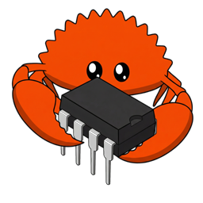
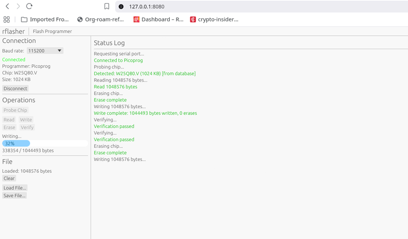

# rflasher

<p align="center">
  
</p>

rflasher reads, writes, and erases SPI flash chips from Rust. It is heavily inspired by [flashprog](https://github.com/SourceArcade/flashprog) and supports 480+ chips (`rflasher list-chips`) and most common programmers: CH341A/CH347, Dediprog, FTDI (MPSSE and FT4222H), serprog, Raiden debug hardware, internal Intel/AMD chipset controllers, Allwinner FEL, and Linux spidev/MTD/GPIO. The same codebase also runs in the browser via WebSerial/WebUSB, and the core crates are `no_std` for reuse in firmware.

Only SPI NOR flash is in scope.

> **⚠️ Alpha software**
>
> rflasher is not ready for production use. For anything critical, use [flashprog](https://github.com/SourceArcade/flashprog) instead.
>
> Before writing: make sure the programmer voltage matches the chip (3.3 V for most SPI flash), check write protection status, and always read a backup first. Corrupting the wrong region (e.g. the Intel ME region) can brick the device permanently.

## Installation

Build from source (Rust 1.85+):

```bash
git clone https://github.com/ArthurHeymans/rflasher
cd rflasher
cargo build --release                                          # default programmers
cargo build --release --features all-programmers               # everything
cargo build --release --no-default-features --features ch341a,serprog  # pick your own
cargo install --path .
```

### USB device permissions

USB programmers (CH341A, CH347, FTDI, Dediprog, Raiden) need udev rules for non-root access, e.g.:

```text
# CH341A
SUBSYSTEM=="usb", ATTR{idVendor}=="1a86", ATTR{idProduct}=="5512", MODE="0660", GROUP="plugdev"

# Raiden Debug SPI / Cr50 (Google debug hardware)
# The backend matches on vendor ID alone, so this rule covers all Google
# devices; add ATTR{idProduct} matches if you want it narrower.
SUBSYSTEM=="usb", ATTR{idVendor}=="18d1", MODE="0660", GROUP="plugdev"
```

Install to `/etc/udev/rules.d/`, run `udevadm control --reload-rules && udevadm trigger`, and add your user to the `plugdev` group (create the group first if your distro doesn't have it).

### Man page

The man page is generated from the CLI definitions:

```bash
cargo run --bin gen-manpage   # writes man/rflasher.1
man -l man/rflasher.1
```

## Usage

```bash
rflasher probe -p ch341a                # detect the flash chip
rflasher info -p ch341a                 # detailed chip information
rflasher read -p ch341a backup.bin      # read flash to a file
rflasher write -p ch341a firmware.bin   # erase, write and verify
rflasher erase -p ch341a
rflasher verify -p ch341a firmware.bin
rflasher list-chips                     # supported chips
rflasher list-programmers               # available programmers
```

Short aliases exist (`r`/`w`/`v`, `E` for erase), the programmer can be set with the `RFLASHER_PROGRAMMER` environment variable, and `-v`/`-vv` increase log verbosity. `rflasher write -p ch341a firmware.bin --no-verify` skips verification.

### Programmers

| Programmer | Parameters | Example |
|---|---|---|
| `ch341a` | — | `rflasher probe -p ch341a` |
| `ch347` | — | `rflasher probe -p ch347` |
| `serprog` | `dev=`, baud rate, or `ip=` | `rflasher probe -p serprog:dev=/dev/ttyUSB0:115200`<br>`rflasher probe -p serprog:ip=192.168.1.100:5000` |
| `dediprog` | `spispeed=` | `rflasher probe -p dediprog:spispeed=12M` |
| `ftdi` | `type=`, `port=`, `divisor=` | `rflasher probe -p ftdi:type=2232h,port=B,divisor=10` |
| `ft4222` | `spispeed=`, `cs=` | `rflasher probe -p ft4222:spispeed=20000,cs=0` |
| `raiden` | — | `rflasher probe -p raiden` |
| `internal` | — | `rflasher probe -p internal` |
| `linux_spi` | `dev=`, `spispeed=` | `rflasher probe -p linux_spi:dev=/dev/spidev0.0,spispeed=4000` |
| `linux_gpio_spi` | `gpiochip=`, `cs=`, `sck=`, `mosi=`, `miso=`, `spispeed=` | `rflasher probe -p linux_gpio_spi:gpiochip=0,cs=25,sck=11,mosi=10,miso=9` |
| `linux_mtd` | `dev=` | `rflasher read -p linux_mtd:dev=0 backup.bin` |
| `sunxi_fel` | — | `rflasher probe -p sunxi_fel` (Allwinner SoC in FEL mode) |
| `dummy` | — | in-memory flash emulator for testing |

Run `rflasher <command> --help` or see the man page for the full option list.

The `internal` programmer uses the chipset's SPI controller on Linux via PCI sysfs and `/dev/mem`, so it usually requires root. Its controller code is `no_std` and can be reused in firmware; see [crates/rflasher-internal](crates/rflasher-internal/README.md).

### Chip database

Chips are defined as RON files in `crates/rflasher-chips/data/vendors/`. Builds with the `static-chips` feature embed the database; otherwise RON files are loaded at runtime from:

1. `./crates/rflasher-chips/data/vendors/`
2. `./chips/vendors/`
3. `/usr/share/rflasher/chips/`
4. `/usr/local/share/rflasher/chips/`

or from a custom path given with `--chip-db <path>`.

### Layouts and regions

Intel Flash Descriptor (IFD) and FMAP layouts let you operate on specific flash regions (BIOS, ME, GbE, ...).

`--region`/`--include` accept `NAME[:FILE]`. With a `FILE`, each region reads to / writes from its own file instead of a full chip image, and the positional file can be omitted. Per-region files must not exceed their region's size; a smaller file covers only the start of the region. When a positional file is combined with per-region files, it must be a full chip image and supplies the data for regions without their own file.

```bash
# Extract a layout from an image
rflasher layout ifd flash.bin -o layout.toml
rflasher layout fmap chromebook.bin -o layout.toml
rflasher layout show layout.toml
rflasher layout create custom.toml --size "16 MiB"

# Read the BIOS region into its own file (IFD parsed from the chip)
rflasher read -p ch341a --ifd -r bios:bios.bin

# Read several regions, each to its own file
rflasher read -p ch341a --ifd --include bios:bios.bin,me:me.bin

# Write a region from its own file
rflasher write -p ch341a --layout layout.toml -r bios:bios_update.bin

# Or write a region out of a full chip image
rflasher write -p ch341a --ifd -r bios full_image.bin
```

### Write protection

```bash
rflasher wp status -p ch341a                       # current protection status
rflasher wp list -p ch341a                         # available protection ranges
rflasher wp enable -p ch341a                       # hardware protection (WP# pin)
rflasher wp disable -p ch341a
rflasher wp range -p ch341a 0,0x100000             # protect start,length
rflasher wp region -p ch341a --ifd bios            # protect a named region
```

## Web interface

A browser-based UI (egui) can drive a programmer straight from the browser: serprog over WebSerial, and CH341A, CH347, FTDI, FT4222H, Dediprog, and Raiden over WebUSB. Both APIs require Chrome/Edge (or Opera); Firefox and Safari support neither, and a secure context (HTTPS or localhost) is mandatory.



```bash
cargo install trunk
rustup target add wasm32-unknown-unknown
cd crates/rflasher-wasm
trunk serve          # dev server with auto-reload on http://localhost:8080
trunk build --release
```

See [crates/rflasher-wasm/README.md](crates/rflasher-wasm/README.md) for details.

## REPL (experimental)

An experimental Steel Scheme REPL can script raw SPI commands (build with `--features repl`):

```bash
cargo build --release --features repl
rflasher repl -p serprog:dev=/dev/ttyACM0
```

```scheme
λ > (read-jedec-id)
=> (239 16389)

λ > (bytes->hex (spi-read READ 0 16))
=> "ff ff ff ff ff ff ff ff ff ff ff ff ff ff ff ff"

λ > (define data (make-bytes 256 #xAA))
λ > (write-enable)
=> #t
λ > (spi-write PP #x1000 data)
=> #t
λ > (wait-ready)
=> #t
```

Type `(rflasher-help)` in the REPL for the full command list.

## Architecture

| Crate | Purpose |
|---|---|
| `rflasher-chip-types` | `no_std` SPI NOR chip data model and provider trait |
| `rflasher-core` | `no_std` SPI protocol, probing, and flash operations (async, runtime-neutral) |
| `rflasher-chips` | RON loading and compiled chip database provider |
| `rflasher-chips-codegen` | build-time generator for the compiled chip database |
| `rflasher-programmers` | feature-gated programmer backends and registry |
| `rflasher-internal` | internal chipset SPI controllers, `no_std`-capable |
| `rflasher-pci` | `no_std` PCI configuration-space abstraction |
| `rflasher-repl` | Steel Scheme scripting |
| `rflasher-wasm` | browser UI (egui, WebSerial, WebUSB) |

All operational APIs are async and executor-independent on every target: the CLI blocks once in `main`, the browser event loop drives the same code over WebUSB/WebSerial. See [docs/architecture.md](docs/architecture.md) for the design details.

## Contributing

### Adding a flash chip

1. Find the datasheet for your chip.
2. Create or update the vendor file under `crates/rflasher-chips/data/vendors/`.
3. Add the chip definition with JEDEC ID, size, erase blocks, and features.
4. Submit a pull request.

```ron
(
    name: "W25Q128.V",
    device_id: 0x4018,
    total_size: MiB(16),
    features: (
        wrsr_wren: true,
        fast_read: true,
        quad_io: true,
    ),
    voltage: (min: 2700, max: 3600),
    erase_blocks: [
        (opcode: 0x20, size: KiB(4)),
        (opcode: 0xD8, size: KiB(64)),
        (opcode: 0xC7, size: MiB(16)),
    ],
    tested: (probe: Ok, read: Ok, erase: Ok, write: Ok, wp: Ok),
)
```

### Adding a programmer

1. Add a module under `crates/rflasher-programmers/src/backends/`.
2. Implement the `SpiMaster` or `OpaqueMaster` trait from `rflasher-core`.
3. Add a feature and optional dependencies in `crates/rflasher-programmers/Cargo.toml`.
4. Register the programmer in `rflasher-programmers/src/registry.rs`.
5. Update the CLI/WASM feature forwarding.

The largest remaining gap is the SPI programmers not yet ported from flashprog.

## License

GPL-2.0-or-later, the same license as flashprog. See [LICENSE](LICENSE).

## Acknowledgments

rflasher is heavily inspired by [flashprog](https://github.com/SourceArcade/flashprog), itself a fork of [flashrom](https://www.flashrom.org/), and much of its chip database and programmer support derives from them. Thanks to all contributors of those projects.
